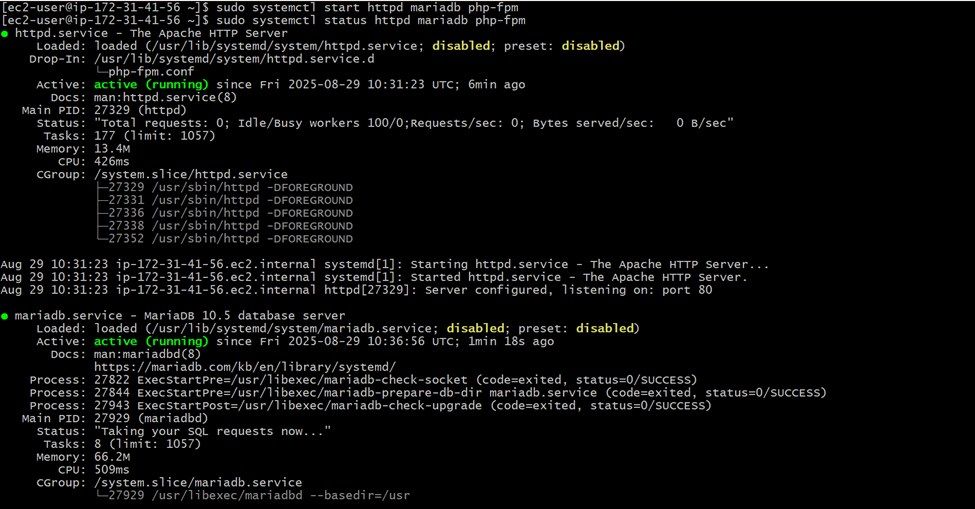
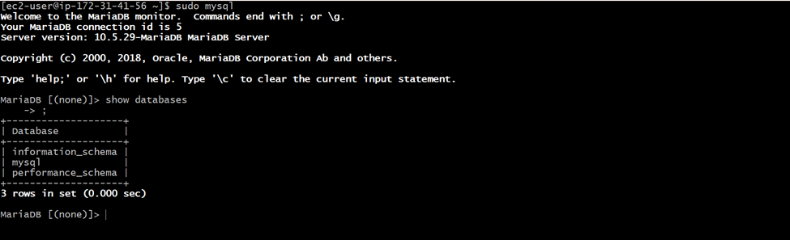
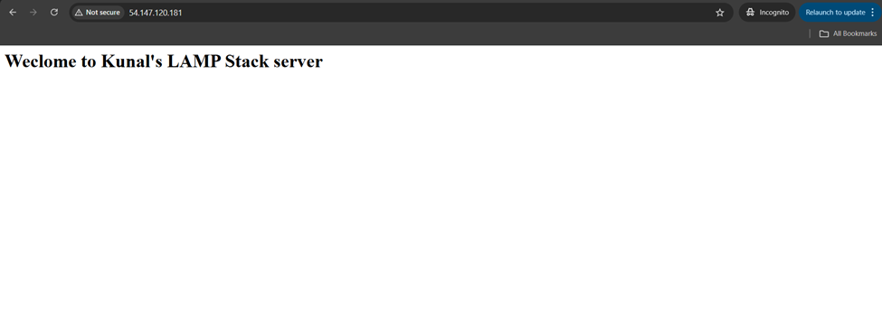
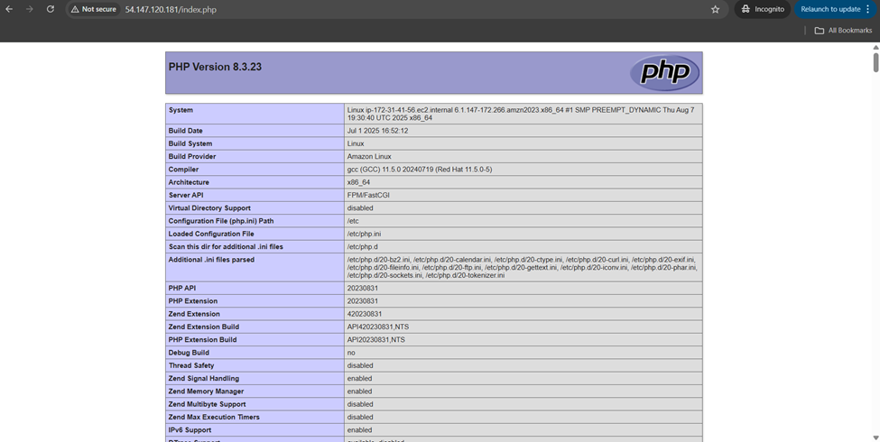

# LAMP Stack Deployment on Amazon Linux


*"Step-by-Step into Web Hosting , Setting Up My First LAMP Environment"*  

---

## Overview
LAMP stands for **Linux, Apache, MariaDB, and PHP**. It is one of the most popular open-source stacks for hosting dynamic websites and web applications. In this guide, we will set up Apache as the web server, MariaDB as the database, and PHP as the scripting language on an Amazon Linux EC2 instance.

---

## Prerequisites
- An Amazon Linux EC2 instance running
- Security Group rules allowing inbound traffic on:
  - **Port 22 (SSH)** for remote access
  - **Port 80 (HTTP)** for Apache web server
- Basic knowledge of Linux commands
- Public IP of your EC2 instance for browser testing

---

## Steps to Deploy

### 1. Update Packages
```bash
sudo yum update -y
````

### 2. Install Required Packages

```bash
sudo yum install httpd -y
sudo yum install mariadb105-server -y
sudo yum install php8.3-fpm -y
```

### 3. Start and Enable Services

```bash
sudo systemctl start httpd mariadb php-fpm
sudo systemctl enable httpd mariadb php-fpm
```

### 4. Verify Service Status

```bash
sudo systemctl status httpd mariadb php-fpm
```



If unsure about service names:

```bash
ls /usr/lib/systemd/system | grep -i <pkg-installed>
```

### 5. Test Apache with HTML

* Create a simple HTML file:

```bash
sudo vim /var/www/html/index.html
```

* Add sample content, save and exit.
* Test:

```bash
curl localhost
```

### 6. Test PHP

* Create a PHP file:

```bash
sudo vim /var/www/html/index.php
```

* Add:

```php
<?php phpinfo(); ?>
```

* Test:

```bash
curl localhost/index.php
```

### 7. Verify MariaDB

```bash
sudo mysql
SHOW DATABASES;
```




### 8. Browser Test

Open your EC2 public IP in a browser:

* `http://<PUBLIC_IP>` → should show HTML page

* `http://<PUBLIC_IP>/index.php` → should show PHP info page


---

## Result
You now have a fully working **LAMP stack** on Amazon Linux EC2, capable of serving both static (HTML) and dynamic (PHP + MariaDB) web pages.

---

## Tech Stack
- **OS**: Amazon Linux  
- **Web Server**: Apache (httpd)  
- **Database**: MariaDB  
- **Backend**: PHP  
- **Hosting**: AWS EC2  


## Summary

We are deploying a LAMP environment on Amazon Linux. The flow is straightforward: update packages → install Apache, MariaDB, and PHP → start and enable services. Once installed, you can test Apache by creating a custom HTML page and PHP by creating an index.php file with `phpinfo()`. You also verify MariaDB by logging into MySQL and listing databases. The final check is accessing your EC2 public IP in a browser to ensure both static and dynamic pages load correctly.

---

